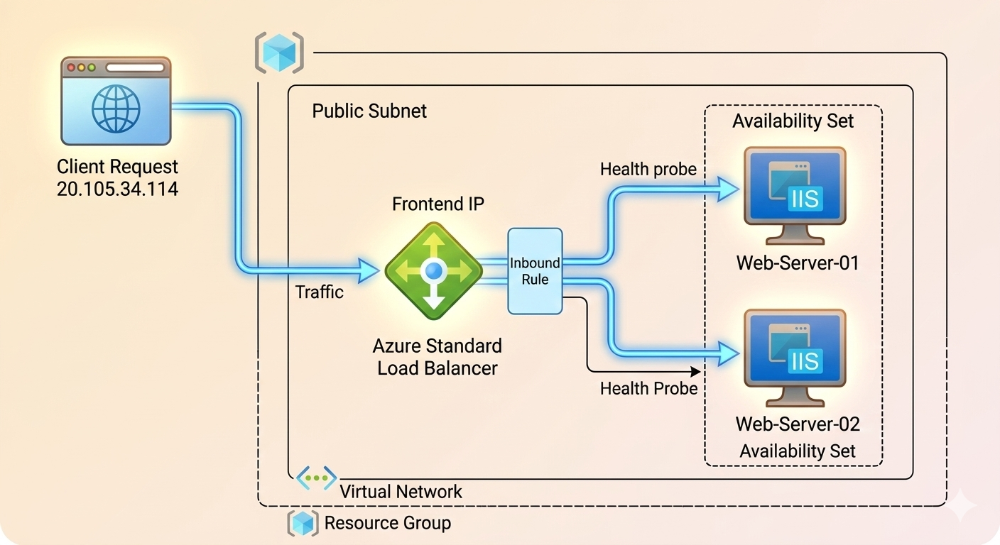
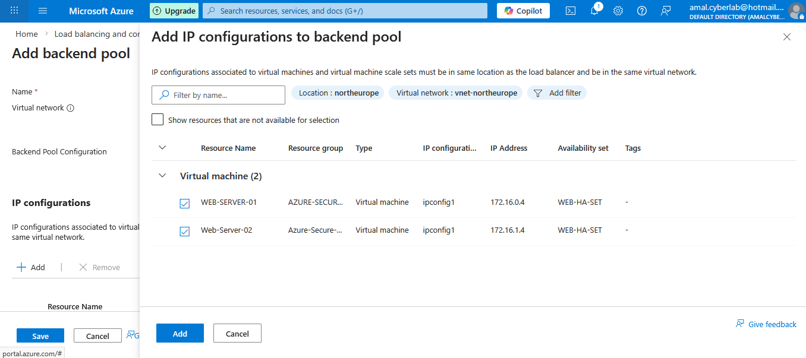
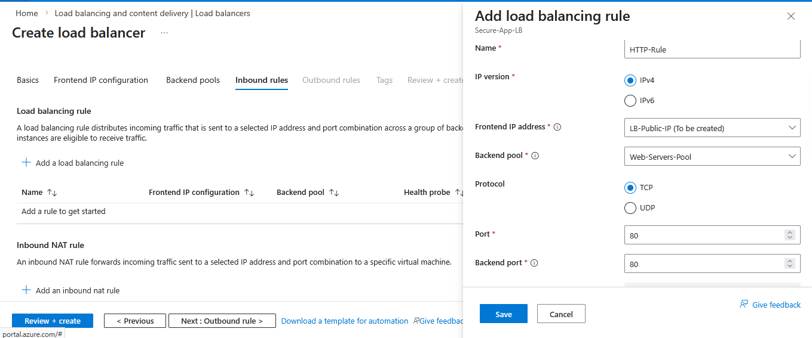
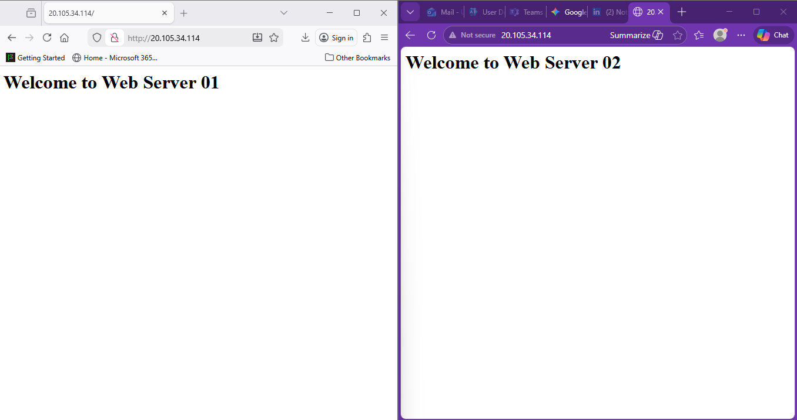

# 🌐 Azure High Availability Web Infrastructure

## 🚀 Project Overview

This project demonstrates how to design and deploy a **Highly Available Web Infrastructure in Microsoft Azure** using:

- Azure Standard Load Balancer
- Windows Server 2025
- Availability Sets
- IIS Web Servers
- PowerShell Automation

The architecture ensures **fault tolerance and traffic distribution** by eliminating **Single Points of Failure (SPOF)**.

---

# 🏗 Architecture



### Traffic Flow

Client Request → Public IP → Azure Load Balancer → Web Servers

---

# ☁ Infrastructure Components

| Resource | Purpose |
|--------|--------|
| Virtual Network | Private Azure networking |
| Subnet | Network segmentation |
| Availability Set | VM redundancy |
| Azure Load Balancer | Traffic distribution |
| Public IP | Internet entry point |
| Windows Server VMs | Hosting IIS |

---

# 🖥 Creating the Virtual Machines

Two Windows Server VMs were deployed inside an **Availability Set** to ensure high availability.


Configuration:

| Setting | Value |
|------|------|
| Fault Domains | 2 |
| Update Domains | 5 |

---

# ⚙ Creating the Azure Load Balancer

The Azure Standard Load Balancer distributes incoming traffic across backend servers.


Configuration:

| Setting | Value |
|------|------|
| Name | Secure-App-LB |
| Type | Public |
| SKU | Standard |

---

# 🌐 Frontend IP Configuration

A Public IP address is assigned as the entry point for internet traffic.


---

# 🖥 Backend Pool Configuration

Both virtual machines are added to the backend pool.



Backend Servers:

| Server | Private IP |
|------|------|
| Web-Server-01 | 172.16.0.4 |
| Web-Server-02 | 172.16.1.4 |

---

# 🔁 Load Balancing Rule

Traffic is distributed using an inbound rule.



| Setting | Value |
|------|------|
| Protocol | TCP |
| Frontend Port | 80 |
| Backend Port | 80 |
| Session Persistence | Disabled |

---

# 💻 Installing IIS using PowerShell

IIS was installed using **Azure Run Command**.


PowerShell Script:

```powershell
Install-WindowsFeature -name Web-Server -IncludeManagementTools
```

Custom landing page created for each server.

```powershell
Set-Content -Path "C:\inetpub\wwwroot\iisstart.htm" `
-Value "<h1>Welcome to Web Server 01</h1>"
```

---

# 🧪 Load Balancer Testing

After deployment, accessing the Load Balancer public IP distributes traffic between both servers.

Example:

```
http://20.105.34.114
```



Refreshing the page alternates between:

- Web Server 01
- Web Server 02


---

# 📊 Infrastructure Summary

| Resource | Count |
|------|------|
| Virtual Machines | 2 |
| Load Balancer | 1 |
| Public IP | 1 |
| Virtual Network | 1 |
| Availability Set | 1 |

---

# 🎓 Learning Outcomes

Through this project I learned:

- Azure Load Balancing concepts
- High Availability architecture
- Infrastructure deployment in Azure
- PowerShell automation
- Fault-tolerant system design

---

# 🧑‍💻 Author

**Amal Basnayake**

Cloud Engineering | Cybersecurity | Infrastructure Labs

---

# ⭐ Support

If you found this project helpful:

⭐ Star the repository  
🍴 Fork the project  
📢 Share with others
